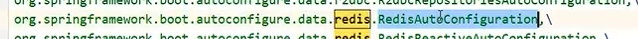
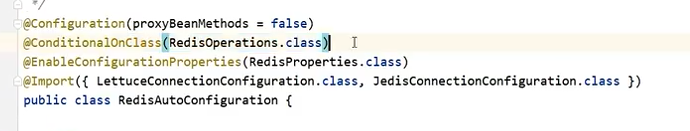
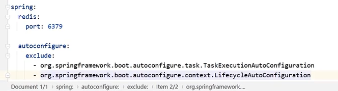
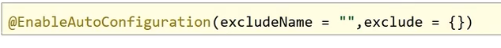

原理篇

初始化实现FactoryBean接口的类，实现对bean加载到容器之前的批处理操作

```java
public class BookFactoryBean implements FactoryBean<Book>{
    public Book getobject()throws Exception{
        Book book new Book();
        //进行book对象相关的初始化证作
        return book;
	}
    public Class<?>getobjectType(){
    return Book.class;
    }
}
```

```java
public class SpringConfig8{
    @Bean//这里最终返回的还是Book
    public BookFactoryBean book(){
        return new BookFactoryBean();
    }
}
```


通过这个注解可以加载配置类并加载配置文件。适用：如果原项目已经打好jar包并且是使用xml方式注入bean

```java
@ImportResource("applicationContext-config.xml")
public class SpringConfig2{

}
```


使用proxyBeanMethods=true可以保障调用此方法得到的对象是从容器中获取的而不是重新创建的

```java
@Configuration(proxyBeanMethods false)
public class SpringConfig3{
    @Bean
    public Book book(){
    System.out.println("book init ...");
    return new Book();
    }
}
```


根据任意条件确认是否加载bean.另外可以使用@Conditional注解

```java
public class MyImportSelector implements ImportSelector{
    @Override
    public String[]selectImports(AnnotationMetadata importingclassMetadata){
            try{
                Class<?>clazz Class.forName("com.itheima.ebean.Mouse");
                if(clazz !null){
                return new String[]{"com.itheima.bean.Cat"};
                }
            } catch (ClassNotFoundException e){
            return new String[];
            }
    return null;
    }
}
```


### 自动装配原理

1.收集Spring开发者的编程习惯，整理开发过程使用的常用技术列表一>（技术集A)
2.收集常用技术（技术集A)的使用参数，整理开发过程中每个技术的常用设置列表-一>（设置集B)
3.初始化SpringBoot基础环境，加载用户自定义的bean和导入的其他坐标，形成初始化环境
4,将技术集A包含的所有技术都定义出来，在Spring/SpringBoot.启动时默认全部加载
5,将技术集A中具有使用条件的技术约定出来，设置成按条件加载，由开发者决定是否使用该技术（与初始化环境比对)
6.将设置集B作为默认配置加载（约定大于配置)，减少开发者配置工作量
7,开放设置集B的配置覆盖接口，由开发者根据自身需要决定是否覆盖默认配置


#### 自动装配实现注解  @SpringBootApplication

内含以下注解

```java
@SpringBootConfiguration
@EnableAutoConfiguration
@ComponentScan(
    excludeFilters = {@Filter(
    type = FilterType.CUSTOM,
    classes = {TypeExcludeFilter.class}
), @Filter(
    type = FilterType.CUSTOM,
    classes = {AutoConfigurationExcludeFilter.class}
)}
)
```

##### 主要实现自动装配的注解是@EnableAutoConfiguration

内含以下注解

```
1.@AutoConfigurationPackage
2.@Import({AutoConfigurationImportSelector.class})
```

##### @AutoConfigurationPackage：

内含 @Import({AutoConfigurationPackages.Registrar.class})--》设置当前配置所在的包为扫描包，后续针对当前的包进行扫描。即SpringBoot启动后要扫描哪些需要加载的bean

```java
public static void register(BeanDefinitionRegistry registry, String... packageNames) {
    if (registry.containsBeanDefinition(BEAN)) {
        BasePackagesBeanDefinition beanDefinition = (BasePackagesBeanDefinition)registry.getBeanDefinition(BEAN);
        beanDefinition.addBasePackages(packageNames);
    } else {
        registry.registerBeanDefinition(BEAN, new BasePackagesBeanDefinition(packageNames));
    }

}
```

##### @Import({AutoConfigurationImportSelector.class})

AutoConfigurationImportSelector实现了很多接口。

```java
public class AutoConfigurationImportSelector implements DeferredImportSelector, BeanClassLoaderAware,
       ResourceLoaderAware, BeanFactoryAware, EnvironmentAware, Ordered {
       
       }
```

其中的关键方法

```java
protected AutoConfigurationEntry getAutoConfigurationEntry(AnnotationMetadata annotationMetadata) {
    if (!isEnabled(annotationMetadata)) {//annotationMetadata:加了SpringBootApplication注解的类 全路径名
       return EMPTY_ENTRY;
    }
    //获取 EnableAutoConfiguration下的 exclude,excludeName配置的类，即排除加载的bean
    AnnotationAttributes attributes = getAttributes(annotationMetadata);
    List<String> configurations = 1.getCandidateConfigurations(annotationMetadata, attributes);//加载.factories配置类下面的bean
    configurations = removeDuplicates(configurations);
    Set<String> exclusions = getExclusions(annotationMetadata, attributes);
    checkExcludedClasses(configurations, exclusions);
    configurations.removeAll(exclusions);
    configurations = getConfigurationClassFilter().filter(configurations);
    fireAutoConfigurationImportEvents(configurations, exclusions);
    return new AutoConfigurationEntry(configurations, exclusions);
}
```

###### 1.getCandidateConfigurations

```java
protected List<String> getCandidateConfigurations(AnnotationMetadata metadata, AnnotationAttributes attributes) {
		List<String> configurations = SpringFactoriesLoader.loadFactoryNames(getSpringFactoriesLoaderFactoryClass(),
				getBeanClassLoader());
		Assert.notEmpty(configurations, "No auto configuration classes found in META-INF/spring.factories. If you "
				+ "are using a custom packaging, make sure that file is correct.");
		return configurations;
	}
```

```java
Enumeration<URL> urls = classLoader.getResources(FACTORIES_RESOURCE_LOCATION);
public static final String FACTORIES_RESOURCE_LOCATION = "META-INF/spring.factories";
```

小结：

1.先开发若干种技术的标准实现
2.SpringBoot启动时加载所有的技术实现对应的自动配置类

例如redis 



3.检测每个配置类的加载条件是否满足并进行对应的初始化。即是否引入了对应的pom依赖。
4.切记是先加载所有的外部资源，然后根据外部资源进行条件比对

排除自动配置：

1.通过配置文件exc1ude属性排除自动配置

2,通过注解2.@EnableAutoConfiguration.属性排除自动配置项



3.启用自动配置只需要满足自动配置条件即可
4.可以根据需求开发自定义自动配置项


#### 配置文件输入内容提示

```xml
<dependency>
    <groupId>org.springframework.boot</groupId>
    <artifactId>spring-boot-configuration-processor</artifactId>
    <optional>true</optional>
</dependency>
```

生成的spring-configuration-metadata.json文件

配置示例：

```json
{
  "groups": [
    {
      "name": "tools.ip",
      "type": "com.example.properties.IpProperties",
      "sourceType": "com.example.properties.IpProperties"
    }
  ],
  "properties": [
    {
      "name": "tools.ip.cycle",
      "type": "java.lang.Long",
      "description": "日志显示周期",
      "sourceType": "com.example.properties.IpProperties",
      "defaultValue": 5
    },
    {
      "name": "tools.ip.cycle-reset",
      "type": "java.lang.Boolean",
      "description": "是否周期内重置数据",
      "sourceType": "com.example.properties.IpProperties",
      "defaultValue": false
    },
    {
      "name": "tools.ip.model",
      "type": "java.lang.String",
      "description": "日志输出模式  detail：详细模式  simple：极简模式",
      "sourceType": "com.example.properties.IpProperties"
    }
  ],
  "hints": [
    {
      "name": "tools.ip.model",
      "values": [
        {
          "value": "detail",
          "description": "详细模式."
        },
        {
          "value": "simple",
          "description": "极简模式."
        }
      ]
    }

  ]
}
```

#### SpringBoot启动流程

1.初始化各种属性，加载成对象
	●读取环境属性(Environment)
	●系统配置（spring.factories)
	●参数(Arguments、application.properties)
2.创建Spring容器对象ApplicationContext,加载各种配置
3.在容器创建前，通过监听器机制，应对不同阶段加载数据、更新数据的需求
4.容器初始化过程中追加各种功能，例如统计时间、输出日志等


```java
//SpringApplication.run

this.sources = new LinkedHashSet();
        this.bannerMode = Mode.CONSOLE;
        this.logStartupInfo = true;
        this.addCommandLineProperties = true;
        this.addConversionService = true;
        this.headless = true;
        this.registerShutdownHook = true;
        this.additionalProfiles = Collections.emptySet();
        this.isCustomEnvironment = false;
        this.lazyInitialization = false;
        this.applicationContextFactory = ApplicationContextFactory.DEFAULT;
        this.applicationStartup = ApplicationStartup.DEFAULT;
		//扩大classLoader作用范围，由一个类的方法扩大为整个类的成员变量。
        this.resourceLoader = resourceLoader;
        Assert.notNull(primarySources, "PrimarySources must not be null");
		//初始化配置类的类名信息(格式转换)
        this.primarySources = new LinkedHashSet(Arrays.asList(primarySources));
		//确认当前容器的加载类型
        this.webApplicationType = WebApplicationType.deduceFromClasspath();
		//获取系统配置引导信息
        this.bootstrapRegistryInitializers = this.getBootstrapRegistryInitializersFromSpringFactories();
       //获取 ApplicationContextInitializer.class对应的实例
this.setInitializers(this.getSpringFactoriesInstances(ApplicationContextInitializer.class));   
		//获取 ApplicationListener.class对应的实例
        this.setListeners(this.getSpringFactoriesInstances(ApplicationListener.class));
		//初始化引导类类名信息
        this.mainApplicationClass = this.deduceMainApplicationClass();

```

```java
 (new SpringApplication(primarySources)).run(args);//初始化容器
```

```java
public ConfigurableApplicationContext run(String... args) {
    //用于SpringBoot启动计时
    StopWatch stopWatch = new StopWatch();
    stopWatch.start();
    //系统引导类信息对应的上下文对象
    DefaultBootstrapContext bootstrapContext = this.createBootstrapContext();
    ConfigurableApplicationContext context = null;
    //做设备的兼容，模拟输入输出信号，避免出现因缺少外设导致的信号传输失败，进而引发错误（模拟显示器，键盘，鼠标....）
    this.configureHeadlessProperty();
    //获取当前可运行的监听器
    SpringApplicationRunListeners listeners = this.getRunListeners(args);
    //监听器执行了对应的步骤
    listeners.starting(bootstrapContext, this.mainApplicationClass);

    try {
        ApplicationArguments applicationArguments = new DefaultApplicationArguments(args);
        //将前期读取的环境参数加载成一个环境对象
        ConfigurableEnvironment environment = this.prepareEnvironment(listeners, bootstrapContext, applicationArguments);
        //设置了一个参数
        this.configureIgnoreBeanInfo(environment);
        //初始化图标
        Banner printedBanner = this.printBanner(environment);
        //创建容器对象，根据前期设置的容器类型进行判定并创建
        context = this.createApplicationContext();
		//设置启动模式
        context.setApplicationStartup(this.applicationStartup);
        
        this.prepareContext(bootstrapContext, context, environment, listeners, applicationArguments, printedBanner);
        this.refreshContext(context);
        this.afterRefresh(context, applicationArguments);
        stopWatch.stop();
        if (this.logStartupInfo) {
            (new StartupInfoLogger(this.mainApplicationClass)).logStarted(this.getApplicationLog(), stopWatch);
        }

        listeners.started(context);
        this.callRunners(context, applicationArguments);
    } catch (Throwable var10) {
        this.handleRunFailure(context, var10, listeners);
        throw new IllegalStateException(var10);
    }

    try {
        listeners.running(context);
        return context;
    } catch (Throwable var9) {
        this.handleRunFailure(context, var9, (SpringApplicationRunListeners)null);
        throw new IllegalStateException(var9);
    }
}
```


监听器类型

1,在应用运行但未进行任何处理时，将发送ApplicationStartingEvent。
2.当Environmenti被使用，且上下文创建之前，将发送ApplicationEnvironmentPreparedEvent。
3,在开始刷新之前，bean定义被加载之后发送ApplicationPreparedEvent。
4,在上下文刷新之后且所有的应用和命令行运行器被调用之前发送ApplicationStartedEvent。
5,在应用程序和命令行运行器被调用之后，将发出ApplicationReadyEvent,用于通知应用已经准备处理请求。
6,启动时发生异常，将发送ApplicationFailedEvent。