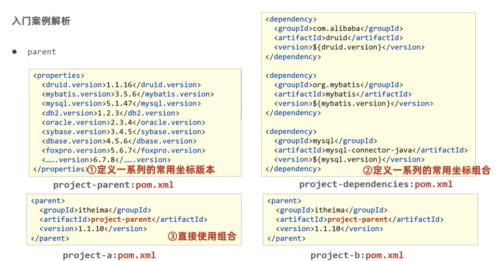
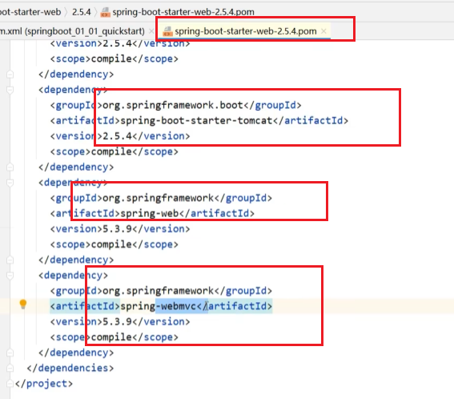
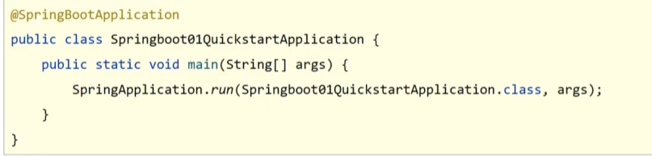
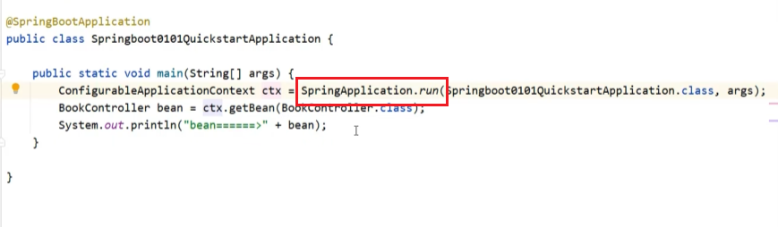
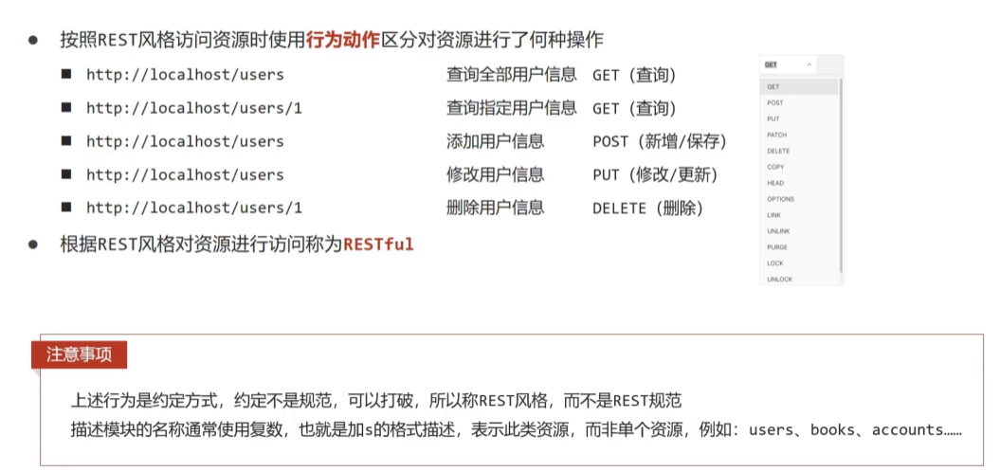

#### 为什么采用SpringBoot?

●SpringBoot是由Pivotal团队提供的全新框架，其设计目的是用来简化Spring.应用的初始搭建以及开发过程

- Spring程序缺点
  ■依赖设置繁琐
  ■配置繁琐
- SpringBoot程序优点
  ■起步依赖（简化依赖配置）
  ■自动配置（简化常用工程相关配置）
  ■辅助功能（内置服务器，…)

以上这些如何做到的呢？

●parent 整合依赖
●starter
●引导类
●内嵌tomcat

#### Parent

1. 开发SpringBoot程序要继承spring-boot-starter-parent 

2. spring-boot-starter-parent中定义了若干个依赖管理 

3. 继承parent模块可以**避免多个依赖使用相同技术时出现依赖版本冲突** 

4. 继承parent的形式也可以采用引入依赖的形式实现效果

   例如项目A,B公用Parent的依赖。



#### Starter

1. 开发SpringBoot程序需要导入坐标时通常导入对应的starter

2. 每个不同的starter根据功能不同，通常包含多个依赖坐标 

   例如

3. 使用starter可以**实现快速配置**的效果，达到简化配置的目的

#### 引导类



带了@SpringBootApplication的类复合注解

SpringApplication.run生成了一个容器。

其中@Componentscan注解：Spring会扫描当前配置类所在包及其子包的所有bean

●SpringBoot的引导类是Boot工程的执行入口，运行main方法就可以启动项目
●SpringBoot.工程运行后初始化Spring容器，扫描引导类所在包加载bean




#### 内嵌tomcat

1,内嵌Tomcat服务器是SpringBoot辅助功能之一
2,内嵌Tomcat.工作原理是将Tomcat服务器作为对象运行，并将该对象交给Spring容器管理
3,变更内嵌服务器思想是去除现有服务器，添加全新的服务器

#### 配置文件加载优先级

1.配置文件间的加载优先级

​	properties(**最高**)

​	yml

​	 yam1（最低)

 2,不同配置文件中相同配置按照加载优先级相互覆盖，不同配置文件中不同配置全部保留

##### yaml语法规则

- 大小写敏感
- 属性层级关系使用多行描述，每行结尾使用冒号结束
- 使用缩进表示层级关系，同层级左侧对齐，只允许使用空格（不允许使用Tb键）
- 属性值前面添加空格（属性名与属性值之间使用冒号+空格作为分隔）
- #表示注释

#### 异常处理

1.使用注解@RestControllerAdvice定义SpringMVC异常处理器用来处理异常的

 2,异常处理器必须被扫描加载，否则无法生效 

3,表现层返回结果的模型类中添加消息属性用来传递消息到页面

```java
//controlLerAavice
@RestControllerAdvice
public class ProjectExceptionAdvice{
    //拦截所有的异常信总息
     @ExceptionHandler 
    public R doException(Exception ex){
        //记录日志//通知运维//通知开发 
        ex.printStackTrace();
        return new R(msg:"服务器故障，请稍后再试！");
    }
}
```

#### Jar包独立运行

1.所有的程序都放在classes下面。

2.所有的依赖放在lib下面。


3.然后再打一个需要独立运行SpringBoot所需工具包的文件夹org。即SpringBoot提供的类加载器。JarLauncher就在这个文件夹下。


补充知识RESTful请求

●REST(Representational State Transfer),表现形式状态转换

- 传统风格资源描述形式
  http://localhost/user/getById?id=1
  http://localhost/user/saveUser
- REST风格描述形式
  http://localhost/user/1
  http://localhost/user

优点：
隐藏资源的访问行为，无法通过地址得知对资源是何种操作
书写简化 



   


  

