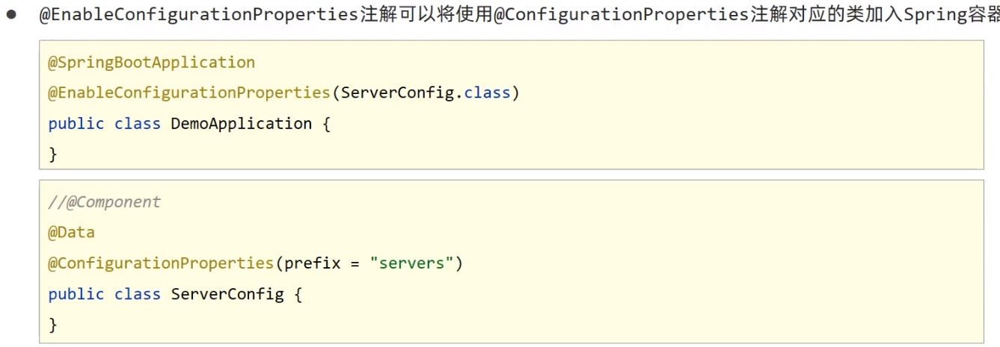
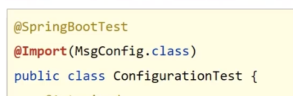
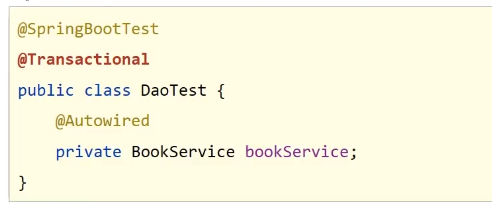
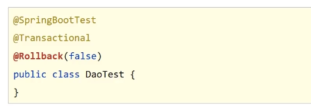

#### @EnableConfigurationProperties

●@EnableConfigurationProperties注解可以将使用@ConfigurationProperties注解对应的类加入Spring容器



@ConfigurationPropertigs绑定属性支持属性名宽松绑定

@Value注解不支持松散绑定

1.注意yam1文件中对于数字的定义支持进制书写格式，如需使用字符串请使用引号明确标注。

否则配置文件中的密码 0127 可能被识别为八进制87导致密码错误。


### 测试类

使用@Import注解加载当前测试类专用的配置



#### Web环境模拟测试

```java
@SpringBootTest(webEnvironment SpringBootTest.WebEnvironment.RANDOM PORT)
//开启虚物MVC调用
@AutoConfigureMockMvc
public class WebTest{
    @Test
    //注入虚MVC调用对象 
    public void testweb(@Autowired MockMvc mvc)throws Exception{
        //创建虚拟请求，当前访问/books 
        MockHttpServletRequestBuilder builder = MockMvcRequestBuilders.get("/books");
        //执行请求 
        ResultActions action mvc.perform(builder);
        }
}
```

#### 数据层测试用例回滚

为测试用例添加事务，SpringBoot会对测试用例对应的事务提交操作进行回滚。



如果想在测试用例中提交事务，可以通过@Rollback注解设置

