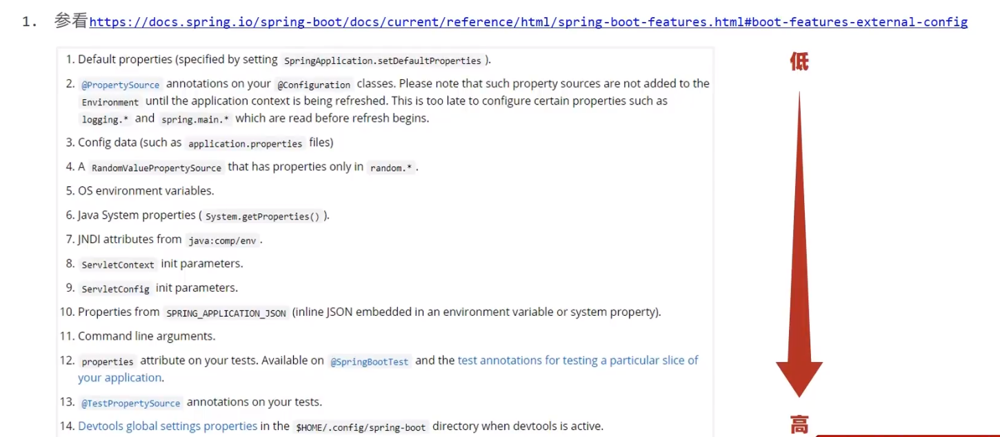
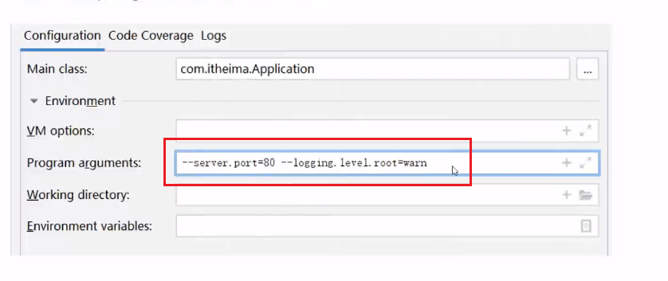
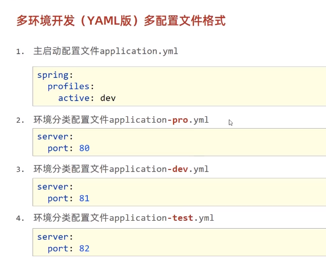
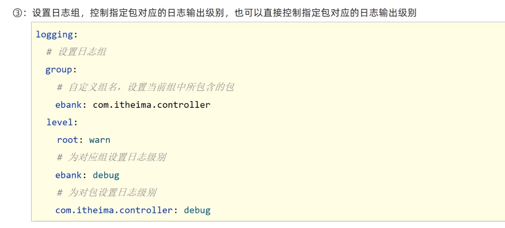

#### 属性加载优先顺序




#### 临时属性设置

```shell
java -jar springboot.jar --server.port=80
```

系统环境变量中的属性优先级高于yml配置文件中的。


带属性启动SpringBooti程序，为程序添加运行属性。



#### 配置文件分类

1.SpringBoot中4级配置文件 

​	1级：file:config./application.yml【最高】

​	 2级：file:application.yml 

​	 3级：classpath:config/application.yml

​	 4级：classpath:application.yml【最低 】

2.作用： 

◆1级与2级留做系统打包后设置通用属性，1级常用于运维经理进行线上整体项目部署方案调控

◆3级与4级用于系统开发阶段设置通用属性，3级常用于项目经理进行整体项目属性调控

**多环境开发（yaml版）**

```yaml
spring: 
  profiles: 
    active:pro 
---
spring: 
  profiles: pro 
server: 
  port:80 
---
spring: 
  profiles:dev 
server: 
   port:81 
 ---
 spring: 
   profiles: test 
 server: port:82
```



#### 日志分组显示

